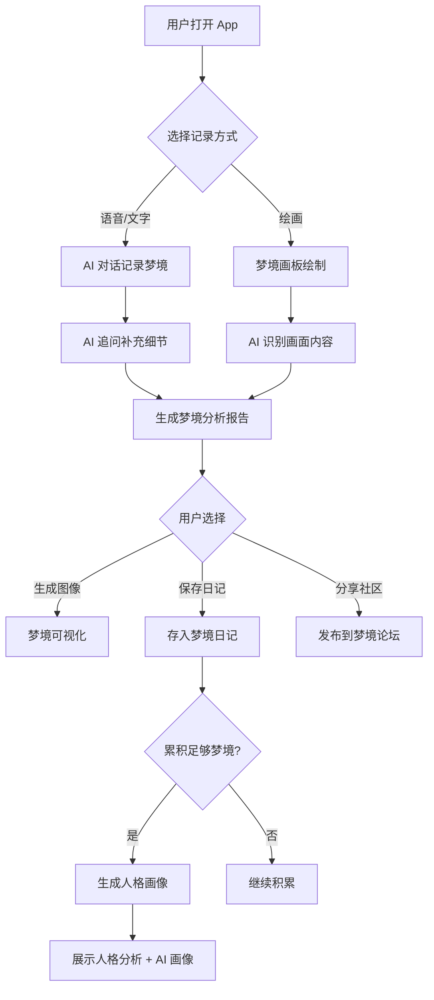

# Dreamer Analyst - AI 梦境分析助手技术文档

## 项目概述

**项目名称**: Dreamer Analyst（AI 梦境分析助手）  
**核心定位**: 基于 AI 的梦境记录、解析与心理健康管理平台  
**目标用户**: 睡眠障碍人群、心理学爱好者、自我探索者

---

## 背景与痛点分析

### 用户需求

| 需求类型 | 具体描述 |
|----------|----------|
| 记录困难 | 人脑苏醒后 5 分钟内迅速遗忘梦境，传统记录方式难以及时捕捉 |
| 心理健康 | 数字时代睡眠和焦虑问题严重，解梦在心理治疗中有效率高达 70.4% |
| 自我认知 | 梦境与潜意识密切相关，正确解析有助于理解决策逻辑和情感模式 |

### 传统产品痛点

1. **单次分析局限**: 仅基于单次梦境描述生成报告，缺乏上下文理解
2. **情感状态盲区**: 对用户近期情绪波动和心理状态了解不足
3. **缺乏长期追踪**: 无法深度剖析梦境之间的关联和人格映射
4. **功能割裂**: 未形成梦境→情绪→睡眠的全链路管理

---

## 核心功能设计

### MVP 功能矩阵

| 功能模块 | 描述 | 优先级 |
|---------|------|--------|
| AI 梦境问答 | 交互式对话记录和解析梦境 | P0 |
| 梦境画板 | 用户通过绘图辅助描述梦境 | P0 |
| 符号解析 | AI 分析梦境符号的象征含义 | P0 |
| 心理需求洞察 | 挖掘用户潜在心理需求 | P0 |
| 梦境日记 | 累积多次梦境，生成长期记录 | P1 |
| 人格画像 | 基于梦境积累生成用户人格分析 | P1 |
| 梦境可视化 | 文生图功能，将梦境转化为画面 | P1 |
| 梦境社区 | 分享梦境、学习解梦知识 | P2 |
| 睡眠数据整合 | 接入智能手环/手表数据 | P2 |

### 功能详细说明

#### 1. AI 交互式梦境问答

```
用户描述梦境 → AI 追问细节 → 补充情境信息 → 生成深度分析报告
```

**交互流程**:
- 用户描述梦境片段
- AI 通过引导式提问补充细节（场景、人物、情绪、颜色等）
- 结合用户历史梦境和近期情绪状态
- 输出符号分析 + 心理解读 + 建议

#### 2. 梦境画板

- Flutter Canvas 实现的手绘画板
- 用户可通过简笔画描述梦境场景
- AI 多模态理解画面内容
- 辅助文字描述不清晰的元素

#### 3. 人格画像生成

```
多次梦境数据 → 主题频率分析 → 情绪模式识别 → 人格特征提取 → 可视化画像
```

---

## 系统架构

```
┌─────────────────────────────────────────────────────────────────┐
│                         移动端 App                               │
│                  (React Native / Flutter)                        │
│     梦境记录 / 画板绘制 / 社区浏览 / 睡眠数据 / 个人中心            │
└─────────────────────────────────────────────────────────────────┘
                                │
                                ▼
┌─────────────────────────────────────────────────────────────────┐
│                       API Gateway                                │
│                   (FastAPI / Node.js)                            │
│           认证授权 / 请求路由 / 限流 / 日志                         │
└─────────────────────────────────────────────────────────────────┘
                                │
       ┌────────────────────────┼────────────────────────┐
       ▼                        ▼                        ▼
┌──────────────────┐  ┌──────────────────┐  ┌──────────────────┐
│   AI 核心服务     │  │   用户服务        │  │   社区服务        │
│                  │  │                  │  │                  │
│ • 梦境对话解析    │  │ • 用户管理        │  │ • 内容发布        │
│ • 符号知识库检索  │  │ • 梦境日记存储    │  │ • 点赞评论        │
│ • 人格画像生成    │  │ • 睡眠数据同步    │  │ • 知识分享        │
│ • 梦境图像生成    │  │ • 隐私设置        │  │ • 话题讨论        │
└──────────────────┘  └──────────────────┘  └──────────────────┘
       │                        │                        │
       └────────────────────────┼────────────────────────┘
                                ▼
┌─────────────────────────────────────────────────────────────────┐
│                        数据层                                    │
│  PostgreSQL (用户/梦境) + Redis (缓存) + Pinecone (向量知识库)    │
└─────────────────────────────────────────────────────────────────┘
```

---

## 技术栈选型

| 层级 | 技术选择 | 说明 |
|------|---------|------|
| **移动端** | Flutter | 跨平台开发，内置 Canvas 支持梦境画板 |
| **后端框架** | Python FastAPI | 异步高性能，AI 生态完善 |
| **LLM 大模型** | GPT-4o / Claude 3 / Qwen-VL | 多模态理解，对话能力强 |
| **知识库** | Pinecone + RAG | 存储专业解梦/心理学知识 |
| **图像生成** | Stable Diffusion API | 梦境可视化 |
| **数据库** | PostgreSQL | 结构化数据存储 |
| **缓存** | Redis | 会话缓存、热点数据 |
| **睡眠数据** | Apple HealthKit / Google Fit API | 同步智能穿戴设备数据 |
| **对象存储** | MinIO / 阿里云 OSS | 存储梦境绘图和生成图像 |

---

## 关键代码示例

### 1. 梦境对话解析服务

```python
# dream_analyzer.py
from openai import OpenAI
from typing import Optional
import json

client = OpenAI()

class DreamAnalyzer:
    """梦境分析核心服务"""
    
    SYSTEM_PROMPT = """你是一位专业的梦境分析师，融合了荣格分析心理学和弗洛伊德精神分析的理论基础。

你的任务是：
1. 倾听用户描述的梦境，通过追问补充关键细节
2. 识别梦境中的核心符号（人物、场景、物品、情绪）
3. 结合用户的生活背景和近期情绪状态进行分析
4. 给出专业但通俗易懂的解读
5. 提供有建设性的心理建议

注意事项：
- 保持温和、共情的语气
- 避免过度解读或武断结论
- 鼓励用户自我探索
- 尊重用户隐私边界"""

    def __init__(self, user_context: Optional[dict] = None):
        self.user_context = user_context or {}
        self.conversation_history = []
    
    def analyze(self, dream_description: str, user_mood: str = None) -> dict:
        """分析单次梦境"""
        
        context_info = ""
        if user_mood:
            context_info += f"\n用户近期情绪状态：{user_mood}"
        if self.user_context.get("recent_dreams"):
            context_info += f"\n用户近期梦境主题：{self.user_context['recent_dreams']}"
        
        prompt = f"""请分析以下梦境：

{dream_description}
{context_info}

请返回 JSON 格式的分析结果：
{{
    "symbols": [
        {{"symbol": "符号名称", "meaning": "象征含义"}},
    ],
    "emotional_tone": "梦境整体情绪基调",
    "psychological_insight": "心理层面的洞察",
    "life_connection": "与现实生活可能的关联",
    "suggestions": ["建议1", "建议2"],
    "follow_up_questions": ["追问问题1", "追问问题2"]
}}"""

        self.conversation_history.append({"role": "user", "content": prompt})
        
        response = client.chat.completions.create(
            model="gpt-4o",
            messages=[
                {"role": "system", "content": self.SYSTEM_PROMPT},
                *self.conversation_history
            ],
            response_format={"type": "json_object"},
            temperature=0.7
        )
        
        result = response.choices[0].message.content
        self.conversation_history.append({"role": "assistant", "content": result})
        
        return json.loads(result)
    
    def follow_up(self, user_response: str) -> dict:
        """处理用户的追问回复，继续深入分析"""
        
        prompt = f"""用户的补充信息：{user_response}

请基于这些新信息，更新你的分析。返回相同的 JSON 格式。"""
        
        self.conversation_history.append({"role": "user", "content": prompt})
        
        response = client.chat.completions.create(
            model="gpt-4o",
            messages=[
                {"role": "system", "content": self.SYSTEM_PROMPT},
                *self.conversation_history
            ],
            response_format={"type": "json_object"},
            temperature=0.7
        )
        
        result = response.choices[0].message.content
        self.conversation_history.append({"role": "assistant", "content": result})
        
        return json.loads(result)
```

### 2. 梦境符号知识库（RAG）

```python
# knowledge_base.py
from pinecone import Pinecone
from openai import OpenAI
import hashlib

client = OpenAI()
pc = Pinecone(api_key="your-api-key")
index = pc.Index("dream-symbols")

class DreamKnowledgeBase:
    """梦境符号知识库，基于 RAG 增强解析准确性"""
    
    def get_embedding(self, text: str) -> list:
        """获取文本向量"""
        response = client.embeddings.create(
            model="text-embedding-3-small",
            input=text
        )
        return response.data[0].embedding
    
    def search_symbols(self, symbol: str, top_k: int = 5) -> list:
        """检索符号的专业解释"""
        embedding = self.get_embedding(symbol)
        
        results = index.query(
            vector=embedding,
            top_k=top_k,
            include_metadata=True
        )
        
        return [
            {
                "symbol": match.metadata.get("symbol"),
                "interpretation": match.metadata.get("interpretation"),
                "source": match.metadata.get("source"),  # 荣格/弗洛伊德/民俗
                "score": match.score
            }
            for match in results.matches
        ]
    
    def add_symbol(self, symbol: str, interpretation: str, source: str):
        """添加新的符号解释到知识库"""
        embedding = self.get_embedding(f"{symbol}: {interpretation}")
        
        doc_id = hashlib.md5(f"{symbol}-{source}".encode()).hexdigest()
        
        index.upsert(vectors=[{
            "id": doc_id,
            "values": embedding,
            "metadata": {
                "symbol": symbol,
                "interpretation": interpretation,
                "source": source
            }
        }])
```

### 3. 人格画像生成

```python
# personality_profiler.py
from collections import Counter
from typing import List
import json

class PersonalityProfiler:
    """基于梦境积累生成人格画像"""
    
    def __init__(self, user_id: str, dream_history: List[dict]):
        self.user_id = user_id
        self.dream_history = dream_history
    
    def extract_themes(self) -> dict:
        """提取梦境主题频率"""
        all_symbols = []
        all_emotions = []
        all_scenarios = []
        
        for dream in self.dream_history:
            if "analysis" in dream:
                analysis = dream["analysis"]
                all_symbols.extend([s["symbol"] for s in analysis.get("symbols", [])])
                all_emotions.append(analysis.get("emotional_tone", ""))
                # 场景提取逻辑
        
        return {
            "symbol_frequency": dict(Counter(all_symbols).most_common(10)),
            "emotion_distribution": dict(Counter(all_emotions)),
            "dream_count": len(self.dream_history)
        }
    
    def generate_profile(self) -> dict:
        """生成完整人格画像"""
        themes = self.extract_themes()
        
        prompt = f"""基于以下用户的梦境统计数据，生成一份人格画像分析：

梦境数量：{themes['dream_count']}
高频符号：{themes['symbol_frequency']}
情绪分布：{themes['emotion_distribution']}

请返回 JSON 格式：
{{
    "personality_traits": ["特质1", "特质2", ...],
    "emotional_patterns": "情感模式描述",
    "inner_desires": ["潜在需求1", "潜在需求2"],
    "growth_suggestions": ["成长建议1", "成长建议2"],
    "dream_portrait_prompt": "用于 AI 生成人格画像图的提示词"
}}"""
        
        from openai import OpenAI
        client = OpenAI()
        
        response = client.chat.completions.create(
            model="gpt-4o",
            messages=[{"role": "user", "content": prompt}],
            response_format={"type": "json_object"}
        )
        
        return json.loads(response.choices[0].message.content)
```

### 4. 梦境图像生成

```python
# dream_visualizer.py
from openai import OpenAI
import requests

client = OpenAI()

class DreamVisualizer:
    """将梦境描述转化为视觉图像"""
    
    STYLE_PROMPTS = {
        "超现实": "surrealist style, dreamlike atmosphere, Salvador Dali inspired",
        "水彩": "soft watercolor painting, ethereal, gentle colors",
        "数字艺术": "digital art, vibrant colors, fantasy style",
        "黑白素描": "black and white sketch, expressive, emotional"
    }
    
    def generate_dream_image(
        self, 
        dream_description: str, 
        style: str = "超现实",
        size: str = "1024x1024"
    ) -> str:
        """生成梦境图像"""
        
        style_suffix = self.STYLE_PROMPTS.get(style, self.STYLE_PROMPTS["超现实"])
        
        prompt = f"""Create a dream visualization: {dream_description}

Art style: {style_suffix}
Mood: mysterious, dreamlike, symbolic
Avoid: text, watermarks, realistic human faces"""
        
        response = client.images.generate(
            model="dall-e-3",
            prompt=prompt,
            size=size,
            quality="standard",
            n=1
        )
        
        return response.data[0].url
    
    def generate_personality_portrait(self, profile: dict) -> str:
        """根据人格画像生成象征性肖像"""
        
        prompt = profile.get("dream_portrait_prompt", "")
        
        enhanced_prompt = f"""{prompt}

Style: artistic portrait, symbolic elements, abstract representation of personality
Elements should include: visual metaphors for the personality traits
Color palette: reflect the emotional patterns
Mood: introspective, meaningful"""
        
        response = client.images.generate(
            model="dall-e-3",
            prompt=enhanced_prompt,
            size="1024x1024",
            quality="hd",
            n=1
        )
        
        return response.data[0].url
```

### 5. 睡眠数据整合

```python
# sleep_integrator.py
from datetime import datetime, timedelta
from typing import Optional
import requests

class SleepDataIntegrator:
    """整合智能穿戴设备的睡眠数据"""
    
    def __init__(self, user_id: str, health_api_token: str):
        self.user_id = user_id
        self.token = health_api_token
    
    def get_sleep_quality(self, date: Optional[datetime] = None) -> dict:
        """获取指定日期的睡眠质量数据"""
        
        # 模拟 Apple Health / Google Fit API 调用
        # 实际实现需要根据具体 API 文档
        
        return {
            "date": (date or datetime.now()).isoformat(),
            "total_sleep_minutes": 420,
            "deep_sleep_minutes": 90,
            "rem_sleep_minutes": 110,
            "light_sleep_minutes": 180,
            "awake_minutes": 40,
            "sleep_score": 78,
            "heart_rate_avg": 58,
            "hrv_avg": 42
        }
    
    def correlate_with_dream(self, dream_date: datetime) -> dict:
        """将睡眠数据与梦境分析关联"""
        
        sleep_data = self.get_sleep_quality(dream_date)
        
        # 分析 REM 睡眠与梦境的关系
        rem_ratio = sleep_data["rem_sleep_minutes"] / sleep_data["total_sleep_minutes"]
        
        insights = []
        if rem_ratio > 0.25:
            insights.append("REM 睡眠占比较高，可能有丰富的梦境活动")
        if sleep_data["sleep_score"] < 60:
            insights.append("睡眠质量较差，可能影响梦境内容和情绪")
        if sleep_data["awake_minutes"] > 60:
            insights.append("夜间醒来较多，可能导致梦境片段化")
        
        return {
            "sleep_data": sleep_data,
            "dream_correlation_insights": insights
        }
```

---

## 数据模型设计

### PostgreSQL 表结构

```sql
-- 用户表
CREATE TABLE users (
    id UUID PRIMARY KEY DEFAULT gen_random_uuid(),
    email VARCHAR(255) UNIQUE NOT NULL,
    nickname VARCHAR(100),
    avatar_url TEXT,
    created_at TIMESTAMP DEFAULT NOW(),
    updated_at TIMESTAMP DEFAULT NOW()
);

-- 梦境记录表
CREATE TABLE dreams (
    id UUID PRIMARY KEY DEFAULT gen_random_uuid(),
    user_id UUID REFERENCES users(id) ON DELETE CASCADE,
    title VARCHAR(255),
    description TEXT NOT NULL,
    canvas_image_url TEXT,  -- 梦境画板图片
    dream_date DATE NOT NULL,
    mood_before_sleep VARCHAR(50),  -- 入睡前情绪
    created_at TIMESTAMP DEFAULT NOW()
);

-- 梦境分析结果表
CREATE TABLE dream_analyses (
    id UUID PRIMARY KEY DEFAULT gen_random_uuid(),
    dream_id UUID REFERENCES dreams(id) ON DELETE CASCADE,
    symbols JSONB,  -- 符号解析结果
    emotional_tone VARCHAR(100),
    psychological_insight TEXT,
    life_connection TEXT,
    suggestions JSONB,
    generated_image_url TEXT,
    created_at TIMESTAMP DEFAULT NOW()
);

-- 人格画像表
CREATE TABLE personality_profiles (
    id UUID PRIMARY KEY DEFAULT gen_random_uuid(),
    user_id UUID REFERENCES users(id) ON DELETE CASCADE,
    traits JSONB,
    emotional_patterns TEXT,
    inner_desires JSONB,
    growth_suggestions JSONB,
    portrait_image_url TEXT,
    dream_count INTEGER,
    generated_at TIMESTAMP DEFAULT NOW()
);

-- 睡眠数据表
CREATE TABLE sleep_records (
    id UUID PRIMARY KEY DEFAULT gen_random_uuid(),
    user_id UUID REFERENCES users(id) ON DELETE CASCADE,
    date DATE NOT NULL,
    total_sleep_minutes INTEGER,
    deep_sleep_minutes INTEGER,
    rem_sleep_minutes INTEGER,
    light_sleep_minutes INTEGER,
    sleep_score INTEGER,
    source VARCHAR(50),  -- apple_health / google_fit
    created_at TIMESTAMP DEFAULT NOW(),
    UNIQUE(user_id, date)
);

-- 社区帖子表
CREATE TABLE community_posts (
    id UUID PRIMARY KEY DEFAULT gen_random_uuid(),
    user_id UUID REFERENCES users(id) ON DELETE CASCADE,
    dream_id UUID REFERENCES dreams(id),
    title VARCHAR(255) NOT NULL,
    content TEXT,
    image_url TEXT,
    is_anonymous BOOLEAN DEFAULT FALSE,
    likes_count INTEGER DEFAULT 0,
    comments_count INTEGER DEFAULT 0,
    created_at TIMESTAMP DEFAULT NOW()
);

-- 创建索引
CREATE INDEX idx_dreams_user_date ON dreams(user_id, dream_date DESC);
CREATE INDEX idx_analyses_dream ON dream_analyses(dream_id);
CREATE INDEX idx_posts_created ON community_posts(created_at DESC);
```

---

## API 接口设计

### RESTful API 端点

| 方法 | 端点 | 描述 |
|------|------|------|
| POST | `/api/v1/dreams` | 创建新的梦境记录 |
| GET | `/api/v1/dreams` | 获取用户梦境列表 |
| GET | `/api/v1/dreams/{id}` | 获取单个梦境详情 |
| POST | `/api/v1/dreams/{id}/analyze` | 触发梦境分析 |
| POST | `/api/v1/dreams/{id}/visualize` | 生成梦境图像 |
| GET | `/api/v1/profile` | 获取用户人格画像 |
| POST | `/api/v1/profile/generate` | 生成/更新人格画像 |
| GET | `/api/v1/sleep` | 获取睡眠数据 |
| POST | `/api/v1/sleep/sync` | 同步睡眠数据 |
| GET | `/api/v1/community/posts` | 获取社区帖子 |
| POST | `/api/v1/community/posts` | 发布社区帖子 |

### 请求/响应示例

```json
// POST /api/v1/dreams
// 请求体
{
    "title": "在云端飞翔的梦",
    "description": "我梦见自己在云层之上飞翔，周围是金色的阳光...",
    "canvas_image_base64": "data:image/png;base64,...",
    "dream_date": "2026-01-29",
    "mood_before_sleep": "焦虑"
}

// 响应
{
    "id": "550e8400-e29b-41d4-a716-446655440000",
    "title": "在云端飞翔的梦",
    "created_at": "2026-01-29T06:30:00Z"
}
```

---

## 工作流程



---

## 开发计划

### 第一阶段：核心功能（3天）

- [ ] FastAPI 后端框架搭建
- [ ] PostgreSQL 数据库设计与部署
- [ ] 梦境记录 CRUD API
- [ ] GPT-4o 梦境对话解析集成
- [ ] 基础用户认证（JWT）

### 第二阶段：AI 增强（2天）

- [ ] Pinecone 知识库搭建
- [ ] RAG 符号检索增强
- [ ] 梦境图像生成（Stable Diffusion）
- [ ] 人格画像分析逻辑

### 第三阶段：移动端（3天）

- [ ] Flutter 项目初始化
- [ ] 梦境记录界面
- [ ] 梦境画板（Canvas）
- [ ] 分析结果展示页
- [ ] 个人中心 & 梦境日记

### 第四阶段：社区 & 优化（2天）

- [ ] 梦境论坛功能
- [ ] 睡眠数据接入
- [ ] UI/UX 优化
- [ ] 测试与 Bug 修复

---

## 竞品分析与差异化

| 竞品 | 优势 | 不足 | 我们的差异化 |
|------|------|------|-------------|
| Somni AI | 功能完善 | 价格较高 | 免费核心功能 + 渐进付费 |
| 周公解梦 | 报告质量好 | 缺乏上下文理解 | 多轮对话 + 历史关联分析 |
| Dreamore | 文生图 + 社区 | 人格画像弱 | 强化长期人格分析 |

### 核心竞争力

1. **全息化数据闭环**: 梦境→情绪→睡眠的完整链路管理
2. **深度个性化**: 基于长期积累的人格画像，而非单次分析
3. **多模态交互**: 文字 + 语音 + 绘画多种记录方式
4. **知识库增强**: 专业心理学知识 RAG 提升准确性

---

## 隐私与安全考虑

| 风险点 | 应对策略 |
|--------|----------|
| 梦境数据敏感性 | 端到端加密 + 用户可随时删除数据 |
| AI 主动追问边界 | 明确告知用户追问目的，提供跳过选项 |
| 心理健康责任 | 明确声明非医疗服务，提供专业求助渠道 |
| 社区内容审核 | 敏感内容过滤 + 举报机制 |

---

## 商业化方向

| 版本 | 功能 | 定价 |
|------|------|------|
| 免费版 | 每月 10 次梦境分析 + 基础日记 | ¥0 |
| Pro 版 | 无限分析 + 梦境图像 + 人格画像 | ¥19.9/月 |
| 高级版 | Pro + 睡眠整合 + 社区特权 | ¥39.9/月 |

---

## 技术风险与应对

| 风险 | 应对策略 |
|------|----------|
| LLM 成本高 | 本地小模型降级 + 缓存常见符号解析 |
| 图像生成延迟 | 异步队列处理 + 预生成通用模板 |
| 睡眠 API 接入复杂 | 优先 Apple Health，逐步扩展 |
| 知识库维护 | 定期更新 + 用户反馈修正 |

---

## 附录：目录结构

```
dreamer-analyst/
├── backend/
│   ├── app/
│   │   ├── main.py
│   │   ├── config.py
│   │   ├── models/
│   │   │   ├── user.py
│   │   │   ├── dream.py
│   │   │   └── analysis.py
│   │   ├── services/
│   │   │   ├── dream_analyzer.py
│   │   │   ├── knowledge_base.py
│   │   │   ├── personality_profiler.py
│   │   │   ├── dream_visualizer.py
│   │   │   └── sleep_integrator.py
│   │   ├── api/
│   │   │   ├── v1/
│   │   │   │   ├── dreams.py
│   │   │   │   ├── profile.py
│   │   │   │   ├── sleep.py
│   │   │   │   └── community.py
│   │   │   └── deps.py
│   │   └── utils/
│   ├── requirements.txt
│   └── Dockerfile
├── mobile/
│   ├── lib/
│   │   ├── main.dart
│   │   ├── screens/
│   │   ├── widgets/
│   │   └── services/
│   └── pubspec.yaml
├── knowledge/
│   ├── symbols/
│   │   ├── jung_symbols.json
│   │   └── freud_interpretations.json
│   └── import_scripts/
├── docker-compose.yml
└── README.md
```
